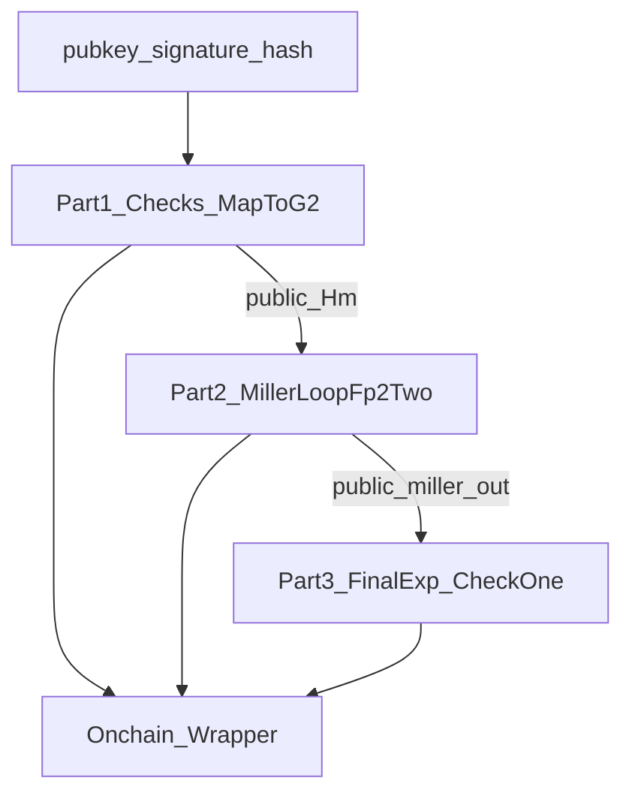

# Split de CoreVerifyPubkeyG1 en 3 pruebas

## Objetivo

Reducir memoria/tiempo por prueba dividiendo el circuito actual (≈19.2M constraints) en **3 circuitos** que producen **3 pruebas Groth16** verificables onchain, encadenadas por **valores intermedios públicos**:

- `Hm` (punto en G2) como output público del paso 1
- `miller_out` (Fp12 = `out[6][2][k]`) como output público del paso 2

## Aha (cómo encaja con tu código actual)

Tu `CoreVerifyPubkeyG1` ya está estructurado así:

- checks + `SubgroupCheckG1/G2` + `MapToG2` y `Hm.isInfinity === 0`
- luego `CoreVerifyPubkeyG1NoCheck` hace `MillerLoopFp2Two` y `FinalExponentiate` y chequea que el resultado sea 1.

Referencia (existente):

```13:137:/Users/josefigueredo/Desktop/web3/zkBridge-lightClient/circuits/utils/circom-pairing/circuits/bls_signature.circom
template CoreVerifyPubkeyG1NoCheck(n, k){
    signal input pubkey[2][k];
    signal input signature[2][2][k];
    signal input Hm[2][2][k];
    signal output out;
    // ... negación firma ...
    component miller = MillerLoopFp2Two(n, k, [4,4], x, q);
    // ...
    component finalexp = FinalExponentiate(n, k, q);
    // ... check finalexp == 1 ...
}

template CoreVerifyPubkeyG1(n, k){
    signal input pubkey[2][k];
    signal input signature[2][2][k];
    signal input hash[2][2][k];
    // ... range checks ...
    component pubkey_valid = SubgroupCheckG1(n, k);
    component signature_valid = SubgroupCheckG2(n, k);
    component Hm = MapToG2(n, k);
    Hm.isInfinity === 0;
    component verify = CoreVerifyPubkeyG1NoCheck(n, k);
    verify.out === 1;
}
```


## Diseño (3 circuitos + encadenado)




- **Part1**: prueba que `pubkey` y `signature` pasan subgroup checks, que inputs están en rango, y calcula `Hm = MapToG2(hash)` (y `Hm != ∞`). Publica `Hm`.
- **Part2**: con `pubkey`, `signature`, `Hm`, calcula `miller_out = MillerLoopFp2Two(...)` (re-hace la negación de firma internamente). Publica `miller_out`.
- **Part3**: con `miller_out`, hace `FinalExponentiate(miller_out)` y **constriñe** que el resultado sea 1 (como ya hace `CoreVerifyPubkeyG1NoCheck`).

## Archivos a agregar/modificar

- Agregar templates de split (sin tocar el circuito original):
- [`circuits/utils/circom-pairing/circuits/bls_signature_split.circom`](/Users/josefigueredo/Desktop/web3/zkBridge-lightClient/circuits/utils/circom-pairing/circuits/bls_signature_split.circom)
    - `template CoreVerifyPart1(n,k)` → output público `Hm`
    - `template CoreVerifyPart2(n,k)` → output público `miller_out`
    - `template CoreVerifyPart3(n,k)` → constriñe finalexp == 1
- Agregar 3 `main` compilables (parámetros igual que hoy `55,7`):
- [`circuits/utils/circom-pairing/scripts/signature/signature_part1.circom`](/Users/josefigueredo/Desktop/web3/zkBridge-lightClient/circuits/utils/circom-pairing/scripts/signature/signature_part1.circom)
- [`circuits/utils/circom-pairing/scripts/signature/signature_part2.circom`](/Users/josefigueredo/Desktop/web3/zkBridge-lightClient/circuits/utils/circom-pairing/scripts/signature/signature_part3.circom)
- [`circuits/utils/circom-pairing/scripts/signature/signature_part3.circom`](/Users/josefigueredo/Desktop/web3/zkBridge-lightClient/circuits/utils/circom-pairing/scripts/signature/signature_part3.circom)

(mismo estilo que el actual `signature.circom`, que hoy es:[`circuits/utils/circom-pairing/scripts/signature/signature.circom`](/Users/josefigueredo/Desktop/web3/zkBridge-lightClient/circuits/utils/circom-pairing/scripts/signature/signature.circom).)

- Exportar 3 verificadores Solidity (snarkjs) y un wrapper:
- `contracts/src/verifiers/VerifierPart1.sol`
- `contracts/src/verifiers/VerifierPart2.sol`
- `contracts/src/verifiers/VerifierPart3.sol`
- `contracts/src/BlsSignatureSplitVerifier.sol` que:
    - recibe (a,b,c) + publicInputs para cada proof
    - verifica las 3 pruebas
    - exige que `pubkey/signature/hash` coincidan donde corresponda y que `Hm`/`miller_out` encadenen (pasando exactamente los mismos arrays a los verificadores)

## Comandos (guía de ejecución)

Para cada parte:

- Compilar: `circom signature_partX.circom --r1cs --wasm --sym -o build/partX`
- Setup Groth16 (ptau existente): `snarkjs groth16 setup build/partX/*.r1cs <ptau> partX_0000.zkey`
- Contribución zkey: `snarkjs zkey contribute ...`
- Export verificador: `snarkjs zkey export solidityverifier partX_final.zkey VerifierPartX.sol`
- Probar end-to-end con un input real: generar `witness`, `proof`, `publicSignals` para cada parte y verificarlas en Solidity.